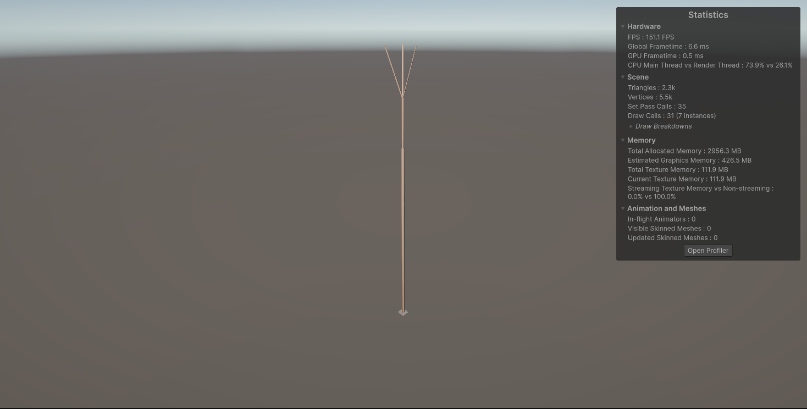
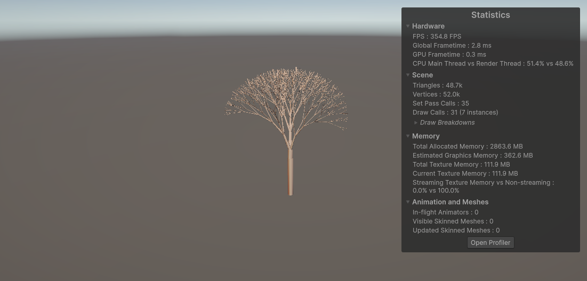

# Scaling L-Systems for Real-Time Flora Growth

## Abstract
This project scales the methods for generating flora using L-Systems as described in *The Algorithmic Beauty of Plants* by Przemyslaw Prusinkiewicz and Aristid Lindenmayer. 
This is done by investigating the efficacy of generating a wide array of unique instances of flora in real-time using efficient construction 
and rendering techniques. These optimization techniques include spatial hashing for faster lookups, incremental mesh streaming for separation of static and dynamic meshes, 
distance based level of detail, and distributing animations over multiple frames according to a frame budget.

The output of a plant generated by an L-System can quickly balloon into hundreds of thousands of individual segments, 
each requiring aspects such as mesh geometry, correct surface normals, and UV coordinates. Additionally, the great variety expected in a natural environment requires either an impractically large library of pre-authored assets, or a generation and rendering algorithm that can produce variation deterministically and efficiently at runtime.  

Working around these limitations to generate flora in real-time is the primary motivator for this project.

The current version of this project is described under [2026 May 1 - Animation, Structural Improvements and Performance Enhancement
](https://github.com/Chief802/DH2323-Procedural-Flora-Growth-Using-L-Systems#2026-may-1---animation-structural-improvements-and-performance-enhancement).  
It is recommended to read (or skim, or to look at the pictures) through the blog up until that point however.

Supervisor: [Professor and director of the Embodied Social Agents Lab (ESAL) Dr. Christopher Peters](https://www.kth.se/profile/chpeters)

Video Demo: WIP.

Full Report: WIP.

Web Player: WIP.

## Implementation
This study's implementation is in three major parts:
- The axioms describing how different species of flora are grown, as can be found in GenerateFlora3D.cpp
- The interpretation of rules, as can be found in LSystem.h
- The bridge from the algorithm to Unity, as can be found in PlantRenderer.cs

The floral axioms and L-System parser is implemented in C++, whereas the Unity bridge is implemented in C#.
A .dll file needs to be built in order to run the program. No additional packages or third-party APIs were used in Unity. 


## Some Update Highlights
### 2026 April 12 \- Project Start  
The feedback to the first project specification draft was returned, allowing goals beyond the implementation aspect to be set.
The focus was consequently set on evaluating the algorithm and its implementation. This was investigated from the following perspectives
- Speed, in terms of how quickly flora could be generated
- Memory, in terms of how expensive a floral instance is
- Realism, in terms of how well the structure of real flora is captured by the L-System  

These aspects were then taken from the individual level of one plant, to investigating how scaling to many more floral instances affects them.

### 2026 April 14 \- The first plant  
Before an evaluation can take place, there needs to be something to evaluate. The current short-term goal for the project was at this point to implement both a basic, 
2-Dimenstional plant, and to be able to have it be shown in Unity (with the use of LineRenderer). This first instance, and its growth stages, can be shown below.


### INTERMISSION - How does a basic L-System work?
What Prusinkiewicz et al and related works fundamentally argue, is that the way plants grow is neither unpredictable or inimitable, but rather in accordance to 
algorithms of various complexities that we ourselves can imitate.

When building an L-System, we apply certain rules to certain symbols, imagined as a turtle moving around (by convention).
- F means go forward one segment
- \+ mean turn left a certain amount of degrees degrees
- [ means to start a new branch
- etc.

This plant above follows a very simply rule:  `F :- F[+F]F[-F]F`  
This tells us that *for every segment F, go forward; start a new branch, turn left, and go forward; go forward; start a new branch, turn right, and go forward; and finally go forward again*. By writing more and more sophisticated rules, we can create more and more sophisticated plants.  

### 2026 April 20 \- What if we had even more dimensions?  
Although there is value in having a 2D implementation (which I shall expand upon in the "future work" section whenever that is written), the goal was always to expand to 3D. This meant that two things needed to be changed:
- The way the turtle moves
- The way the plant is rendered  

The TurtleState struct now has a 3D position and three vectors U (Up), L (Left), and H (Heading) for direction.
These allow us to implement  pitch, yaw, and roll for the turtle.

```
inline void RotateTurtle(TurtleState &t, char axis, float alpha)
    {
        const float ca = std::cos(alpha), sa = std::sin(alpha);
        const Vec3 oH = t.H, oU = t.U, oL = t.L;
        switch (axis)
        {
        case 'U':
            t.H = {oH.x * ca + oL.x * sa, oH.y * ca + oL.y * sa, oH.z * ca + oL.z * sa};
            t.L = {-oH.x * sa + oL.x * ca, -oH.y * sa + oL.y * ca, -oH.z * sa + oL.z * ca};
            break;
        case 'L':
            t.H = {oH.x * ca - oU.x * sa, oH.y * ca - oU.y * sa, oH.z * ca - oU.z * sa};
            t.U = {oH.x * sa + oU.x * ca, oH.y * sa + oU.y * ca, oH.z * sa + oU.z * ca};
            break;
        case 'H':
            t.L = {oL.x * ca - oU.x * sa, oL.y * ca - oU.y * sa, oL.z * ca - oU.z * sa};
            t.U = {oL.x * sa + oU.x * ca, oL.y * sa + oU.y * ca, oL.z * sa + oU.z * ca};
            break;
        default:
            break;
        }
    }
```

This first 3D implemented cylinders to connect points for simplicitity, but was later to be changed to something that had more of a justification for its implementation. 
Nevertheless, the implementation looked like the following:
```
void BuildBranchMesh(Segment[] segments, int count)
    {
        if (Keyboard.current.spaceKey.wasPressedThisFrame)
        List<Vector3> vertices = new List<Vector3>();
        List<int> triangles = new List<int>();
        List<Vector3> normals = new List<Vector3>();

        for (int i = 0; i < count; i++)
        {
            Vector3 a = ToUnityVector(segments[i].a);
            Vector3 b = ToUnityVector(segments[i].b);

            float radius = segments[i].radius * Mathf.Lerp(1f, 0.25f, i / (float)count);

            AddCylinder(
                a,
                b,
                radius,
                radialSegments,
                vertices,
                triangles,
                normals
            );
        }

        Mesh mesh = new Mesh
        {
            indexFormat = UnityEngine.Rendering.IndexFormat.UInt32
        };

        mesh.SetVertices(vertices);
        mesh.SetTriangles(triangles, 0);
        mesh.SetNormals(normals);
        mesh.RecalculateBounds();

        mf.mesh = mesh;
    }
```

An example of a 3-Dimensional plant can be found in the next section.

### 2026 April 29 \- Greater control and refactoring
In order to simulate more advanced plants, a more advanced L-System was required. This was accomplished by expanding the L-System in two major ways
- Making it stochastic
- Making it parametric

A stochastic L-System allows multiple branching paths for one specific rule enabling diversity withing a plant species.  
An example can be seen below:

```
static int BuildStochasticShrub(int iters, PlantNode *out, int maxNodes, unsigned int seed)
{
    LSystem sys(seed);

    sys.AddRule('A', 0.34f, [](const std::vector<float> &)
                { return Sentence{{'F'}, {'['}, {'+'}, {'A'}, {'~'}, {']'}, {'F'}, {'['}, {'-'}, {'A'}, {'~'}, {']'}, {'A'}}; });
    sys.AddRule('A', 0.33f, [](const std::vector<float> &)
                { return Sentence{{'F'}, {'['}, {'+'}, {'A'}, {'~'}, {']'}, {'A'}}; });
    sys.AddRule('A', 0.33f, [](const std::vector<float> &)
                { return Sentence{{'F'}, {'['}, {'-'}, {'A'}, {'~'}, {']'}, {'A'}}; });

    Sentence result = sys.Generate(MakeSentence("A"), iters);

    return InterpretFull(result, 0.3f, 25.0f, out, maxNodes);
}
```
Stochastic L-Systems can additionally be used to set a natural limit for how large a plant can grow, by making it so that end-points, such as flowers,
become more and more likely to occur as the tree has more iterations. This can then culminate in a 100% chance after a set limit, naturally having the plant stop growing.  

A parametric L-System on the other hand enables different rules to carry parameters. These can be parameters such as length in the case of movement, an angle in the case of turning, or directly setting a branches radius to a value of choice. Previously, every time a rule appeared it had the same value, limiting choice greatly.  
An example of this can be found from the following implemenation of a tree from *The Algorithmic Beauty of Plants*:

```
static int BuildABOPTree(int iters, PlantNode* out, int maxNodes, unsigned int seed)
{
    constexpr float d1 = 94.74f;
    constexpr float d2 = 132.63f;
    constexpr float a  = 18.95f;
    constexpr float lr = 1.109f;
    constexpr float vr = 1.732f;

    LSystem sys(seed);

    // p1 – Apex expansion with leaves and a single apical flower
    sys.AddRule('A', [](const std::vector<float>&) {
        return Sentence {
            Symbol('!', {vr}),
            Symbol('F', {50.f}),

            Symbol('['),
                Symbol('&', {a}), Symbol('F', {50.f}), Symbol('A'),
                Symbol('~', {2.0f}),   // leaf near this arm's apex
            Symbol(']'),

            Symbol('/', {d1}),

            Symbol('['),
                Symbol('&', {a}), Symbol('F', {50.f}), Symbol('A'),
                Symbol('~', {2.0f}),
            Symbol(']'),

            Symbol('/', {d2}),

            Symbol('['),
                Symbol('&', {a}), Symbol('F', {50.f}), Symbol('A'),
                Symbol('~', {2.0f}),
            Symbol(']'),

            Symbol('@', {1.5f}),       // flower at the meristem apex
        };
    });

    // p2 – Segment elongation
    sys.AddRule(ProductionRule{
        'F', 1.0f, nullptr,
        [](const std::vector<float>& p) {
            float l = p.empty() ? 1.f : p[0];
            return Sentence { Symbol('F', {l * lr}) };
        }
    });

    // p3 – Radius fattening (pipe model)
    sys.AddRule(ProductionRule{
        '!', 1.0f, nullptr,
        [](const std::vector<float>& p) {
            float w = p.empty() ? 1.f : p[0];
            return Sentence { Symbol('!', {w * vr}) };
        }
    });

    Sentence axiom {
        Symbol('!', {1.f}),
        Symbol('F', {200.f}),
        Symbol('/', {45.f}),
        Symbol('A'),
    };

    Sentence result = sys.Generate(axiom, iters);

    std::cout << "[ABOPTree]  iter=" << iters
              << "  seed=" << seed
              << "  nodes=" << result.size() << "\n";

    return InterpretFull(result, 1.0f, 22.5f, out, maxNodes);
}
```

This creates the following tree, at iteration 1 and 5. Note that the performance output shown is of little interest - since nothing is moving - except for the scene output showcasing the number of triangles and vertices.

  
The next step is to implement animations (a much better stress test) and a nicer way to connect parts of the tree (notice the different cylinders being very visible)  

Lastly, the current rules for the L-System are the following:
- F(l)   Draw forward, step = l
- f(l)   Move forward, no geometry
- ~(s)   Emit a Leaf  at current position, size = s   
- @(s)   Emit a Flower at current position, size = s
- !(w)   Set current radius to w
- \+ \-  Yaw   left / right   
- & ^    Pitch  down / up
- \ /    Roll   left / right
- |      U-turn (180°)
- \[]   Start/end branch  

Note that all angle options also take in parameters.  

### INTERMISSION - What is Realism?
During this part of the project, determining the meaning of the generator being "realistic" was also put under consideration, as its evaluation is non-trivial. We are aided by the fact that one of the purposes of L-Systems, as described by the ABOP literature, is to aid in *"The quest for photorealism"*. Consequently one could argue by using the very algorithm itself aids in plants being realistic. However, to help fulfill the goal of having a more accurate meaning of realism, some on-the-ground research was performed to establish a ground truth for realism.  

In other words: I went out and took pictures of trees.


  

[See more pictures here.](https://drive.google.com/drive/folders/11BrrhxrQySDOilO-TjIVJu34_9ztmRNU?usp=sharing)  

The argument for doing this is that a real-life plant, by definition, is realistic. If we have aimed to imitate the structure of a real plant, we have aimed to fulfill the realism aspect of our project. Additionally, ensuring that floral instances are different - by making our L-System stochastic - allows us to generate many instances of the same species of plant while ensuring diversity. This to aids in a forest, garden, or similar "feeling" realistic. Defining realism formally might be an endeavor worth undertaking for the final project report.

### 2026 May 1 \- Animation, Structural Improvements and Performance Enhancement
After extending to three dimensions, in addition to allowing plants of whichever complexity we want, the next step was to shift the project focus to the Real-Time rendering aspect.  

To begin with, a better tester plant was created that would be both stochastic and parametric, featuring both leaves and flowers. This plant will naturally stop growing after enough iterations have taken place, with a trunk that additionally gets smaller as the plant grows upwards. The rules for it are as follows:  
```
static int BuildCustomTree(int iters, PlantNode *out, int maxNodes, unsigned int seed)
{
    LSystem sys(seed);

    std::mt19937 local_rng(seed);

    sys.AddRule(ProductionRule{
        'A', 1.0f,
        nullptr,
        [&local_rng](const std::vector<float> &p)
        {
            // Extract parameters: [length, radius, depth]
            float l = p.empty() ? 1.0f : p[0];
            float r = p.size() > 1 ? p[1] : 0.8f;     // Starting trunk thickness
            float depth = p.size() > 2 ? p[2] : 0.0f; // Tracks current iteration tier

            // Chance to bloom reaches 100% by depth 8
            float chance = depth >= 8.0f ? 1.0f : depth / 8.0f;
            std::uniform_real_distribution<float> dist(0.0f, 1.0f);

            if (dist(local_rng) < chance)
            {
                // TERMINAL STATE: Branch stops growing, produces a rosette leaf cluster and a flower
                return Sentence{
                    Symbol('!', {r}),
                    Symbol('F', {l}),
                    Symbol('['), Symbol('+', {30.f}), Symbol('~', {l * 0.9f}), Symbol(']'),
                    Symbol('['), Symbol('-', {30.f}), Symbol('~', {l * 0.9f}), Symbol(']'),
                    Symbol('['), Symbol('^', {30.f}), Symbol('~', {l * 0.9f}), Symbol(']'),
                    Symbol('['), Symbol('&', {30.f}), Symbol('~', {l * 0.9f}), Symbol(']'),
                    Symbol('@', {l * 3.0f})};
            }
            else
            {
                // Branch gets thinner, spawns leaves and new sub-branches
                return Sentence{
                    Symbol('!', {r}),
                    Symbol('F', {l}),

                    // Small leaves along the stem
                    Symbol('['), Symbol('+', {50.f}), Symbol('~', {l * 0.4f}), Symbol(']'),
                    Symbol('['), Symbol('-', {50.f}), Symbol('~', {l * 0.4f}), Symbol(']'),

                    // Side Branch 1
                    Symbol('['), Symbol('+', {30.f}), Symbol('^', {15.f}),
                    Symbol('A', {l * 0.85f, r * 0.6f, depth + 1.f}), Symbol(']'),

                    // Side Branch 2
                    Symbol('['), Symbol('-', {35.f}), Symbol('&', {10.f}),
                    Symbol('A', {l * 0.8f, r * 0.55f, depth + 1.f}), Symbol(']'),

                    // Side Branch 3 (adds 3D volume using the roll '\' operator)
                    Symbol('['), Symbol('\\', {90.f}), Symbol('+', {40.f}),
                    Symbol('A', {l * 0.75f, r * 0.5f, depth + 1.f}), Symbol(']'),

                    // Main Trunk elongation (scales 'r' by 0.85 to taper smoothly)
                    Symbol('A', {l * 0.95f, r * 0.85f, depth + 1.f})};
            }
        }});
```

From one iteration to another, branches, leaves, and flowers are created. The goal is to have the transition from one of these iterations to the next appear smooth, such that the aforementioned plant parts are extended from previously existing ones. The user should additionally not need to input anything to have the plant grow from one stage to the next - continuity is important. The state-of-the-art method for animating plant growth was formalized in the aptly named [Animation of plant development](https://www.researchgate.net/publication/220720547_Animation_of_plant_development) by Prusinkiewicz et al. Plants are grown in a BFS-ordered sequence \- meaning they branch out from the start-point. In the ComputeTimelines function branches are grown first, followed by leaves and flowers after a certain delay. 
```
// Calculates exactly when each node should start and stop growing based on its depth in the tree.
// Simulates natural propagation from root to tips.
void ComputeTimelines()
{
    ...
    // Process branches
    foreach (int i in bfsOrder)
    {
        ulong h = NodeHash(_curBranches[i]);
        bool old = _knownHashes.Contains(h);
        NodeAnim a;

        if (old)
        {
            // Already grown, keep static
            a = new NodeAnim { StartT = 0f, EndT = 0f, IsNew = false };
            segEndT[i] = 0f;
        }
        else
        {
            // Calculate growth window based on parent's end time
            int pi = _cachedGraph.Segments[i].Parent;
            float startT = (pi < 0) ? 0f : segEndT[pi];
            float endT = Mathf.Min(1f - FOLIAGE_WINDOW, startT + branchWindow);
            a = new NodeAnim { StartT = startT, EndT = endT, IsNew = true };
            segEndT[i] = endT;
        }

        _timeline[h] = a;
        var key = Quantize(_curBranches[i].end);
        
        if (!tipEndT.TryGetValue(key, out float prev) || segEndT[i] > prev)
            tipEndT[key] = segEndT[i];
    }

    // Process foliage (Starts after its parent branch is fully grown)
    void AssignFoliage(List<PlantNode> nodes)
    {
        foreach (var node in nodes)
        {
            ulong h = NodeHash(node);
            if (_knownHashes.Contains(h))
            {
                _timeline[h] = new NodeAnim { StartT = 0f, EndT = 0f, IsNew = false };
                continue;
            }

            var key = Quantize(node.origin);
            if (!tipEndT.TryGetValue(key, out float parentEndT))
                parentEndT = 1f - FOLIAGE_WINDOW;

            _timeline[h] = new NodeAnim
            {
                StartT = parentEndT,
                EndT = Mathf.Min(1f, parentEndT + FOLIAGE_WINDOW),
                IsNew = true,
            };
        }
    }

    AssignFoliage(_curLeaves);
    AssignFoliage(_curFlowers);
}
```

We can additionally save on resources by only investigating nodes that actually need to grow, whereas if a part has been unchanged then we can deem it finished. This is made to mirror the incremental mesh streaming approach - essentially rendering a 3D model progressively - described by Yoon et al. in [Mesh Layouts for Block-Based Caches
](https://www.researchgate.net/publication/3410557_Mesh_Layouts_for_Block-Based_Caches). Unitys [Mesh.MarkDynamic()](https://docs.unity3d.com/6000.3/Documentation/ScriptReference/Mesh.MarkDynamic.html) "hints" that a mesh will be updated regulary, allowing us to optimize its rendering.
```
if (animate)
{
    // Calculates when each node should start and stop growing based on its depth in the tree.
    ComputeTimelines();
    var (leafShape, flowerShape) = TypeShapes[treeType];
    int leafDetail = ActiveLeafDetail();

    // Populate stable meshes with old nodes to keep them off the dynamic update loop
    BuildBranchMesh(BuildMode.Stable, _stableBranchMesh);
    BuildLeafMesh(_curLeaves, leafShape, leafDetail, true, FilterMode.OnlyOld, _stableLeafMesh);
    BuildFlowerMesh(_curFlowers, flowerShape, true, FilterMode.OnlyOld, _stableFlowerMesh);

    // Records the current layout to differentiate "old" structure from "new" structure later.
    RefreshKnownHashes();
    _animProgress = 0f;
    // Coroutine handling the frame-by-frame mesh update of new segments.
    _growthCoroutine = StartCoroutine(GrowthAnimation());
}
```

The _growthCoroutine seen above ensures that too much is not attempted at the same time - animation is split up over frames. This will help avoid extreme performance hits, as well as the program crashing.
```
// Coroutine handling the frame-by-frame mesh update of "new" segments.
IEnumerator GrowthAnimation()
{
    var (leafShape, flowerShape) = TypeShapes[treeType];
    int leafDetail = ActiveLeafDetail();
    float elapsed = 0f;

    while (elapsed < growthDuration)
    {
        elapsed += Time.deltaTime;
        _animProgress = Mathf.Clamp01(elapsed / growthDuration);

        // Rebuild growing meshes inside existing dynamic mesh objects
        BuildBranchMesh(BuildMode.Growing, _growingBranchMesh);
        BuildLeafMesh(_curLeaves, leafShape, leafDetail, false, FilterMode.OnlyNew, _growingLeafMesh);
        BuildFlowerMesh(_curFlowers, flowerShape, false, FilterMode.OnlyNew, _growingFlowerMesh);

        yield return null;
    }

    // Once complete, merge everything back into the static mesh 
    _animProgress = 1f;
    _growthCoroutine = null;
    RebuildAllFull();
    ArmContinuousTimer();
}
```
Implementing a dynamic Level of Detail scheme was also for the purpose of performance. The distance from the camera to the plant affects the LOD directly.
```
    //Checks distance from the camera to swap the level of detail (LOD) geometry.
    void UpdateLod()
    {
        _lodTimer -= Time.deltaTime;
        if (_lodTimer > 0f || _growthCoroutine != null) return;
        _lodTimer = lodCheckInterval;

        Camera cam = Camera.main;
        if (cam == null || lodSettings == null || lodSettings.Length == 0) return;

        float dist = Vector3.Distance(cam.transform.position, transform.position);
        int newLod = lodSettings.Length - 1;
        
        // Determine correct LOD tier
        for (int i = 0; i < lodSettings.Length; i++)
            if (dist <= lodSettings[i].maxDistance) { newLod = i; break; }

        if (newLod == _activeLod) return;
        _activeLod = newLod;
        _currentRadialSegs = lodSettings[_activeLod].branchRadialSegments;
        
        RebuildAllFull(); // Force a rebuild if the LOD tier changes
    }
```
Throughout the working process testing was done to look at progress and work on making generation and rendering more efficient. Below are two versions of 25 trees being generated simulateneously using random seeds. Among previously mentioned methods of improving performance, simply ensuring that large arrays and lists such as _verts are preallocated helps avoid needless runtime calculations, as well as [spatial hashing](https://www.researchgate.net/publication/2909661_Optimized_Spatial_Hashing_for_Collision_Detection_of_Deformable_Objects) for much better lookup complexity. The changes overall led from a fps of 10-20 at worst originally, to one of 40-35 fps with the changes implemented. Two video examples can be seen below: 

[First version of animation implementation.](https://drive.google.com/file/d/1SHFigK0BJLCoaQEyeYByQspLdPtttUMK/view?usp=drive_link)

[Improved version of animation implementation.](https://drive.google.com/file/d/10gUE37sNEC_C_KQyNiAsOM6gOOgn56r2/view?usp=drive_link)  

Finally, unlike the previous version, plants feature better connections between segments. The general cylinder model, as described by Bloomenthal [Modeling the Mighty Maple ](https://dl.acm.org/doi/10.1145/325165.325249) involves constructing rings of vertices at a segments beginning and end, followed by stitching them together.
```
// Emits a circle of vertices to represent a slice of a branch.
void EmitRing(Vector3 center, float radius, Vector3 frameN, Vector3 frameB, float vCoord, int R)
{
    for (int s = 0; s < R; s++)
    {
        float theta = s / (float)R * Mathf.PI * 2f;
        Vector3 outDir = Mathf.Cos(theta) * frameN + Mathf.Sin(theta) * frameB;
        _verts.Add(center + outDir * radius);
        _norms.Add(outDir);
        _uvs.Add(new Vector2((float)s / R, vCoord)); // Map UV horizontally along the texture
    }
}
```

This can then be utilized by BuildBranchMesh:
```
 void BuildBranchMesh(BuildMode mode, Mesh targetMesh)
{
    ...
    while (queue.Count > 0)
    ...
        // Connect this segment's base to the parent's tip to prevent gaps
        int baseStart = (seg.Parent >= 0 && tipRingStart[seg.Parent] >= 0) ? tipRingStart[seg.Parent] : _verts.Count;
        if (baseStart == _verts.Count) EmitRing(seg.Origin, r, frameN, frameB, 0f, R); // No parent; generate new base
        
        Vector3 tipPos = seg.Origin + tangent * (segLen * growT);
        float tipR = r * Mathf.Lerp(0.05f, 1f, growT); // Tapering slightly at the tip
        
        tipRingStart[idx] = _verts.Count;
        EmitRing(tipPos, tipR, frameN, frameB, 1f, R);
        
        tipPositions[idx] = tipPos;
        tipTangents[idx] = tangent;
        
        // Stitch the base ring and tip ring together with triangles
        for (int s = 0; s < R; s++)
        {
            int sn = (s + 1) % R;
            int b0 = baseStart + s, b1 = baseStart + sn;
            int t0 = tipRingStart[idx] + s, t1 = tipRingStart[idx] + sn;
            
            // Two triangles per quad segment
            _tris.Add(b0); _tris.Add(b1); _tris.Add(t0);
            _tris.Add(t0); _tris.Add(b1); _tris.Add(t1);
        }
    ...
    FlushToMesh(targetMesh);
}
```

A Rotation-Minimizing Frame or a Parallel-Transport Frame (Originally a "Bishop Frame" - ["There is More than One Way to Frame a Curve"](https://www.researchgate.net/publication/210222830_There_is_More_than_One_Way_to_Frame_a_Curve) is used to prevent twisting during rotation, ensuring trees look smoother. These "twists" would manifest as flips along branches. 
```  
// Rotates a normal vector from an old tangent direction to a new one, avoiding twists.
static Vector3 ParallelTransport(Vector3 n, Vector3 from, Vector3 to)
{
    Vector3 axis = Vector3.Cross(from, to);
    float sinA = axis.magnitude, cosA = Vector3.Dot(from, to);
    if (sinA < 1e-6f) return n; // Tangents are parallel
    return Quaternion.AngleAxis(Mathf.Atan2(sinA, cosA) * Mathf.Rad2Deg, axis / sinA) * n;
}
```

